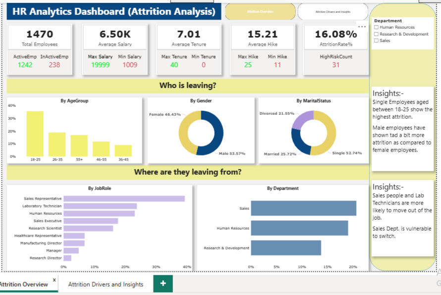
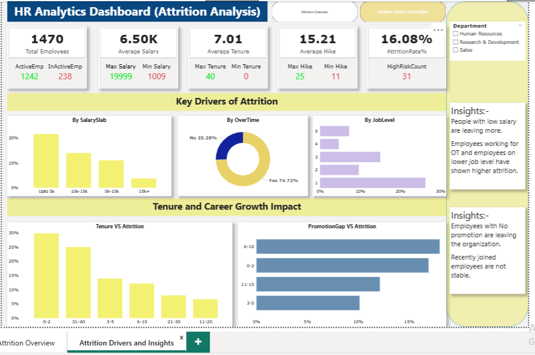

# 📊 HR Analytics Dashboard: Understanding Employee Attrition
Interactive HR Analytics Dashboard built in Power BI to analyze employee attrition, workforce demographics, job satisfaction, and retention trends.

## 📌 Project Overview

Employees are the backbone of every organization. When talented employees leave, companies face increased recruitment costs, productivity loss, and disruptions in business operations.

To better understand workforce trends and employee turnover, I developed an **HR Analytics Dashboard in Power BI** that transforms employee data into actionable insights. The dashboard helps HR professionals identify attrition patterns, analyze workforce demographics, and explore factors that may influence employee retention.

---

## 🎯 Business Objective

The primary objective of this project was to answer key HR questions:

* What is the overall employee attrition rate?
* Which departments experience the highest employee turnover?
* How does attrition vary across employee demographics?
* Are factors such as overtime, job satisfaction, and work-life balance linked to attrition?
* What insights can support better workforce planning and retention strategies?

---

## 📂 Dataset Information

The dataset contains employee records including:

* Employee Demographics
* Department and Job Role
* Attrition Status
* Monthly Income
* Job Satisfaction
* Work-Life Balance
* Overtime Status
* Performance Rating
* Years at Company
* Education and Marital Status

---

## 📸 Dashboard Preview

---
## 📈 Dashboard Highlights

### Compensation & Attrition

* Employees with lower salary levels exhibited significantly higher attrition rates.
* Employees in lower job levels were more likely to leave the organization.
* Overtime was associated with increased employee turnover, indicating potential workload-related retention challenges.

### Career Growth & Retention

* Employees who had not received recent promotions showed a greater tendency to leave.
* Newly hired employees demonstrated higher attrition, suggesting challenges in early-stage employee retention and onboarding.

### Demographic Analysis

* Single employees aged 18–25 experienced the highest attrition rates among all demographic groups.
* Male employees showed slightly higher attrition compared to female employees.

### Department & Job Role Analysis

* Sales Representatives and Laboratory Technicians were among the job roles with the highest attrition levels.
* The Sales department emerged as the most vulnerable area for employee turnover, highlighting the need for targeted retention strategies.

## 💼 Recommendations

Based on the analysis, organizations can consider:

* Reviewing compensation structures for lower salary bands.
* Monitoring overtime and workload distribution to reduce employee burnout.
* Strengthening onboarding and engagement programs for new hires.
* Creating clear career progression and promotion pathways.
* Implementing retention initiatives for high-risk departments such as Sales.
* Focusing employee engagement efforts on younger workforce segments.

## 💡 Business Value

This dashboard supports data-driven HR decision-making by helping organizations:

* Monitor workforce health.
* Reduce employee attrition.
* Improve retention strategies.
* Identify workforce trends early.
* Support strategic HR planning.

## 🚀 Project Outcome

This project demonstrates how Power BI can be used to convert raw HR data into meaningful business insights. By leveraging interactive visualizations and KPI tracking, organizations can better understand employee behavior and make informed workforce decisions.

---

## 🛠️ Tools & Technologies

| Tool               | Purpose                        |
| ------------------ | ------------------------------ |
| Power BI           | Dashboard Development          |
| Power Query        | Data Cleaning & Transformation |
| DAX                | KPI Calculations               |
| Data Visualization | Business Insights & Reporting  |

---
### Skills Demonstrated

* Data Cleaning
* Data Transformation
* HR Analytics
* KPI Development
* Data Visualization
* Dashboard Design
* Business Insight Generation
* Power BI
* Power Query
* DAX
